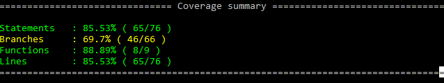
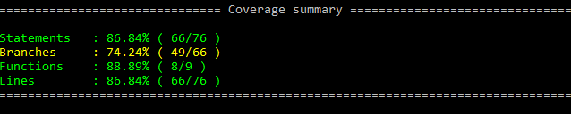

## CrashMonkey
A research project by *Aniket Lawande* under the guidance of *Prof. Dr. Christopher Parnin*.

### Research
Automated test generation is a sub area and cross of automated software engineering, devops and artificial intelligence making it quite a challenging problem to solve. Human developers are able to write test cases effectively because they are aware of the intention of the module to be tested, its input/output domain and pre, post execution conditions. But giving the same context to a machine is not a trivial task. Throughout other languages like Java, C#, this challenge is partially solved using configuration metadata, annotations and skeleton generation. Even then, test generation results are bloated with trivial test cases with high percentage of false positives and little improvement in code coverage and bug detection.

This problem becomes significantly more difficult when dealing with a language like Javascript where objects are arbitrary and there is little metadata about programs and their components. Test generation in Javascript based projects have to rely on static code analysis, genetic algorithms and a high user involvement feedback loop. In most cases the effort of integration of such generators and their usage far outweighs the gains achieved due to low returns on code coverage or bug findings. 

The following are the most prominent techniques is Javascript test case generation
* Domain-specific constraint based
* Heuristics and best practices
* Fuzzing existing tests
* Genetic algorithms

Domain specified test generation techniques have comparitively better results (code coverage and bug reduction improvement) but genetic algorithms show the most promise in the effective test generation area.

### Procedure
CrashMonkey combines the principles of domain-specific constraints, heuristics, and fuzzing to produce smarter and more effective test cases. Using static analysis techniques like ast parsing and ternjs as well as dynamic techniques like dynamic parsing and test case tracing, additional knowledge about the module to be tested is gained and is used to produce intelligent test cases closer to what a developer would.

Typically most test case generation libraries operate by working on the current snapshot of the code. This produces a large number of test cases that are tough to distill, trace and are an overall maintainence nightmare. This kind of test case bloat is the primary reason many test case generation techniques face a barrier to adoption. CrashMonkey minimizes test case bloat by only testing functions that were affected by the latest commit. This prevents generation of a large number of test cases and automatically makes them more effective because they are directly relevant to the code most immediately checked in. This reduces cognitive load for the developer as well.

CrashMonkey was designed to be as test framework agnostic as possible in order to be widely adopted and effective. This is done by having test case formatters and runners that can be plugged in for every test framework. Formatters understand how the test-framework test cases are structured (for generation and analysis) and runners know how to run the test cases and report the results. The mocha instances of the same have been written along with the project. 

The typical flow for a module is as follows  
1. Code checkin (Developer)  
2. Get code and functions that changed (CrashMonkey)  
3. Infer types statically using Ternjs (CrashMonkey)  
4. Analyse test cases using Ternjs and dynamic tracing (CrashMonkey)  
5. Generate test cases using results from static and dynamic analysis (CrashMonkey)  
6. Run test cases and act on results (Developer)

### Execution
Being designed as a framework, CrashMonkey has various modules with callable APIs. The TDD style of development ensures that APIs conform to expected behaviour. The [Orchestrator](../lib/Orchestrator.js) module is the highest level API, tying most of the other modules together. Orchestrator APIs include  
* getFuncsChanged - Get functions that were affected by the commit
* generateTestCases - Analyse changed functions and generate test cases
* executeTestCases - Executes test cases given test files

### Findings
The efforts of the project were more focused on developing a framework and laying a foundation for generation of more intelligent Javascript test cases for a wide variety of projects. This was achieved by combining various test generation strtegies and keeping the architecture test-framework and domain agnostic. Using limited implementations of the various test generation principles, CrashMonkey has shown to produce lesser, more effective test cases for certain libraries. Being designed to be extensible, CrashMonkey can be improved and refined with ease to add new domain contrainsts and test-frameworks.

#### Results
[node-dateformat](https://github.com/felixge/node-dateformat) was chosen as a sample library to be tested on because of the simplistic transformative nature of the library and well-defined testable domain with respect to automation of constrainsts. The project has a reasonable number of callable functions and written test cases that can be compared with for coverage improvement. 
CrashMonkey was able to analyze the function in question, infer types for parameters and analyze test cases to provide additional intelligence for those types as well test case structure, context and assertions. As seen below, there is an appreciable increase in coverage after running the CrashMonkey suite of test generation techniques on the library.

**Before CrashMonkey**  
  

**After CrashMonkey**  

CrashMonkey (CM) was able to locate the function under consideration (affected by the latest commit) using dynamic parsing. CM then performed a static inference of the types of the parameters. Here it knew, that the function accepts a certain number of parameters and the types of the primitive parameters but not the date type parameter. At this point, it went through the test cases using dynamic tracing to isolate the test cases that touch the function under consideration. CM then analyzed these test cases to gain further information of the function calls and then inferred that one of parameters is being called with a date type. After this, test case generation proceeded using the date domain for that parameter and the respective primitive types for the other parameters. Tests generateed using this knowledge were found to increase coverage specifically a certain number of branches that were overlooked by developer written test cases.

### Glossary
* AST (Abstract Syntax Tree) - A representation of source code in terms of symbols, expressions and tokens that a machine can understand. Typically an AST is an intermediate artifact between source code and compilers
* Esprima - A library that constructs an AST from given source code
* Ternjs - A library that given source code can provide basic intelligence over symbols and types
* Static analysis - Analysis of source code without execution
* Dynamic parsing - Analysus of source code with execution
* Dynamic (test case) tracing - Tracing which test cases test a function under consideration by injecting arbitrary code and executing all test cases.
* Test framework - A test library that executes test cases written to a specification
